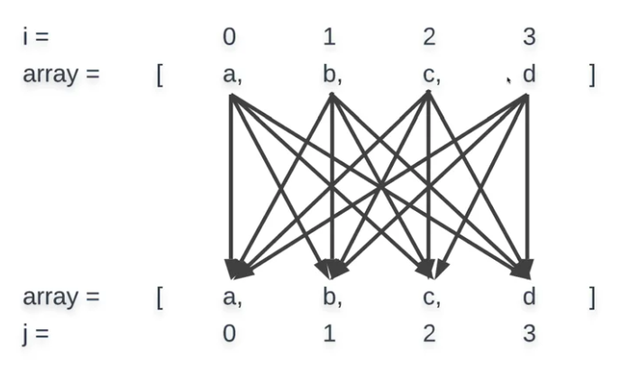
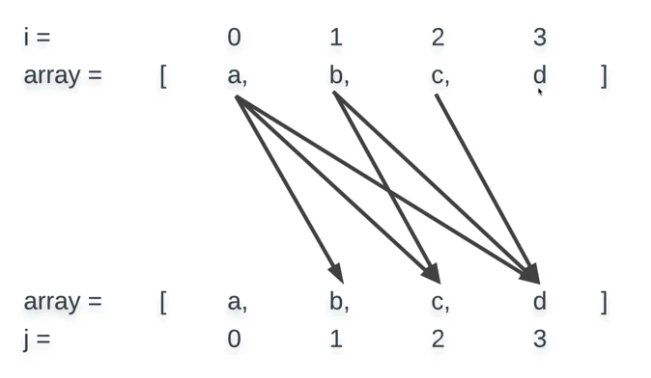

[Functions](./functions.js)
---------------------------

**Function declaration syntax** - function name is built into the declaration of the function

    function sayHello1() {
      console.log('hello');
      console.log('bye');
    }

**Function expression syntax** - setting a variable to an anonymous function

    let sayHello2 = function() {
      console.log('hello');
      console.log('bye');
    };

Functions are **first class objects** - functions can be saved to variables

    // examples of what can be saved to a variable

    let name = 'Alvin'
    let age = 1000;
    let getAvg = function(num1, num2) {
      return (num1 + num2)/2
    };

[Mutability](./mutability.js)
-----------------------------

**Immutable** Types - Cannot be mutated - Examples - Number, e.g. `122` - `NaN` - `undefined` - `null` - String, e.g. `abc`

**Mutable** Types - Can be mutated - Examples - Arrays, e.g. `['a', 'b', 'c']` - Objects (we will see this later)

[Array Functions](./array_functions.js)
---------------------------------------

`Array.prototype.push` - This is how it will show up on MDN. We also like to use the notation, `Array#push` - takes a single argument and adds the argument passed in to the end of the array that it is called on - mutates the array it is called on - returns the length of the mutated array

    let people = ['Gordon', 'Soon-Mi', 'Angela'];
    people.push('Justin');

    console.log(people); // ['Gordon', 'Soon-Mi', 'Angela', 'Justin']

`Array.prototype.pop` or `Array#pop` - doesn’t take any arguments and removes the last element in the array - mutates the array it is called on - returns the removed element

    let dogs = ['Fido', 'Digby', 'Fluffy'];

    const lastDog = dogs.pop();

    console.log(lastDog); // 'Fluffy'
    console.log(dogs); // ['Fido', 'Digby']

`Array.prototype.shift` or `Array#shift` - doesn’t take any arguments and removes the first element in the array - mutates the array it is called on - returns the removed element

    let cats = ['Paprika', 'Whiskers', 'Garfield'];

    let firstCat = cats.shift();

    console.log(firstCat); // 'Paprika'
    console.log(cats); // ['Whiskers', 'Garfield']

`Array.prototype.unshift` or `Array#unshift` - takes a single argument and adds the argument to the beginning of the array - mutates the array it is called on - returns the length of the mutated array

    let cats = ['Whiskers', 'Garfield']

    cats.unshift('Sennacy');

    console.log(cats); // ['Sennacy', 'Whiskers', 'Garfield']
    console.log(beforeUnshift === cats);

[Nested Loops](./nested_loops.js)
---------------------------------

    for (let i = 0; i < 3; i++) {
      for (let j = 0; j < 4; j++) {
        console.log(i, j);
      }
    }

[Pairs In Arrays](./pairs_in_arrays.js)
---------------------------------------

-   Nested loops with arrays

### Pairs In Arrays

### Unique Pairs In Arrays

