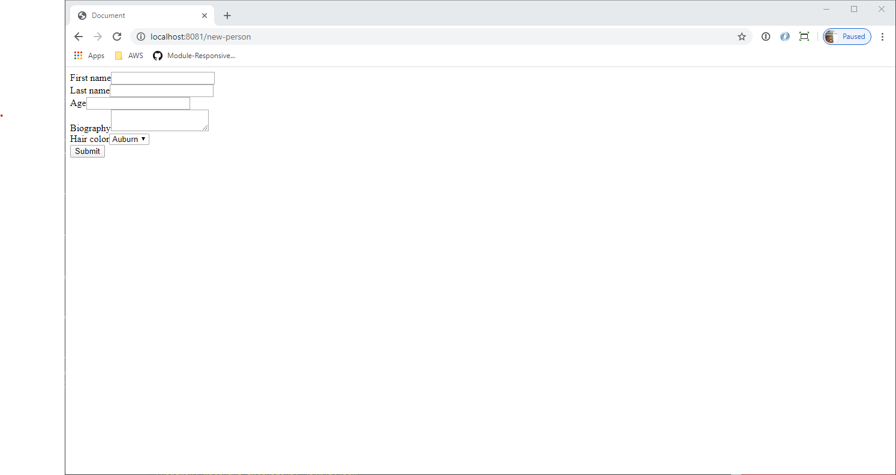
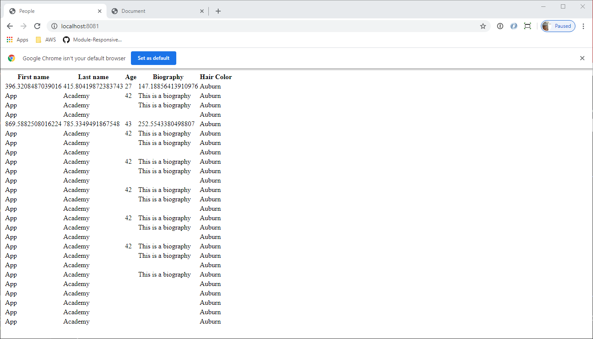

Express Application Practice Assessment
=======================================

**Note:** To read this in a rendered view, open your VS Code Command Palatte (using Control+Shift+P on Windows, Command+Shift+P on macOS) and choose “Markdown: Open Preview” or “Markdown: Open Preview to Side”.

In this assessment, you are asked to create an Express application. You will create an Express application that

-   Has a page that shows a list of people
-   Has a page that allows you to add a person
-   Is protected from Cross-Site Request Forgeries

There are screenshots in the **images** directory that show you what is expected from a *structure* standpoint. They are meant to be guides. The tests will *not* make any assertions about the styling of your pages, merely the structure of the pages.

Use the technologies you have used up to this point. They are all installed in the **package.json** for your convenience.

-   Express.js
-   “pg”, Sequelize, and Sequelize CLI
-   CSURF middleware
-   Pug.js
-   cookie-parser middleware
-   body-parser middleware
-   nodemon (for development purposes)

A **package.json** file already exists with “mocha”, “chai”, and “supertest” as part of the dependencies. Please run `npm install` to install those before running your tests.

Running the application
-----------------------

You can run your application in “dev” mode. The **nodemon** package is installed and runnable from `npm run dev`.

Running the tests
-----------------

This is “black-box testing”. The tests will *only* use your Express application. It will not make connections to the database or directly test your route handlers. They will merely make HTTP requests of your Express app and analyze the responses.

To ease your development, tests will run against your **development** database and *not* the test database.

**You** will be responsible for creating, migrating, and seeding the data in your development database.

Run your tests with `npm test`.

App Requirements
----------------

These are the requirements for the application. Follow them closely. The tests will attempt to read data from your rendered HTML. The tests will **not** make any connections to your database. However, the name of the login, the login password, and the database are provided for you so that instructors can easily run your code, if need be.

Read all of the requirements. Determine the data needed to include in your data model.

Please use port 8081 for your Express.js server.

### The database

-   The login name that you must use is “express\_practice\_app”
-   The login password that you must use is “EzB5Dxo2dabnQBF8”
-   The login **must** have the “CREATEDB” permission for the tests to run
-   The database prefix for your databases must be “express\_practice” so that you will have in your Sequelize config file:
    -   “express\_practice\_development”
    -   “express\_practice\_test” (won’t be used by the tests)
    -   “express\_practice\_production” (won’t be used by the tests)

You will need to store “people” data and “hair color” data. The people data should support:

<table><thead><tr class="header"><th>Attribute name</th><th>Attribute type</th><th>Constraints</th></tr></thead><tbody><tr class="odd"><td>First name</td><td>Up to 50 characters of text</td><td>Must always have a non-null value</td></tr><tr class="even"><td>Last name</td><td>Up to 50 characters of text</td><td>Must always have a non-null value</td></tr><tr class="odd"><td>Age</td><td>An integer</td><td>No constraint</td></tr><tr class="even"><td>Biography</td><td>As much text as possible</td><td>No constraint</td></tr><tr class="odd"><td>Hair color</td><td>reference to hair color data</td><td>Must always have a non-null value</td></tr></tbody></table>

The hair color data should have the

<table style="width:99%;"><colgroup><col style="width: 16%" /><col style="width: 30%" /><col style="width: 53%" /></colgroup><thead><tr class="header"><th>Attribute name</th><th>Attribute type</th><th>Constraints</th></tr></thead><tbody><tr class="odd"><td>Color</td><td>Up to 50 characters of text</td><td>Must always have a non-null value, must be unique</td></tr></tbody></table>

Moreover, the hair color data must have the following pre-defined data in it

-   Auburn
-   Black
-   Blonde
-   Brown
-   Other
-   Red
-   White

If you use Sequelize CLI seeders, don’t forget to add the entry:

    "seederStorage": "sequelize"

to the config.json so that it will track your seed files and not run them too many times.

**NOTE:** All of the data constraints for this assessment can be handled by the database with the `allowNull` flag in your migrations. You **do not** need to use form validations in this project. They are good to have, in general, but can require too much time for you to integrate them into this project. Again, you **do not** need to use a form validator, just use database constraints and catch exceptions that occur when you try to save data.

### Your main file

You must use the **app.js** file to create and configure your Express application. You must store the instance of your Express.js application in a variable named “app”. That is what is exported at the bottom of the **app.js** file.

Set up your CSRF middleware to use cookies.

### The route “GET /”

When someone accesses your application, they should see a list of people that are stored in your database. The list should contain:

-   The person’s first name
-   The person’s last name
-   The person’s age
-   A short biography
-   Their hair color

### The route “GET /new-person”

This page shows a form in which a visitor can add a new person. The form must have

-   a method of “post”
-   an action of “/new-person”

In the form, you should have these inputs with the provided name:

<table><thead><tr class="header"><th>Field HTML name</th><th>Field type</th><th>Constraints</th><th>Default values</th></tr></thead><tbody><tr class="odd"><td>firstName</td><td>single-line text</td><td>required</td><td></td></tr><tr class="even"><td>lastName</td><td>single-line text</td><td>required</td><td></td></tr><tr class="odd"><td>age</td><td>number</td><td></td><td></td></tr><tr class="even"><td>biography</td><td>multi-line text</td><td></td><td></td></tr><tr class="odd"><td>hairColorId</td><td>dropdown</td><td>required</td><td>One of the pre-defined hair colors</td></tr><tr class="even"><td>_csrf</td><td>hidden</td><td></td><td>The value provided by the CSURF middleware</td></tr></tbody></table>

You should also have a submit button.

Please refer to the screenshot.

### The route “POST /new-person”

The post handler should validate the data from the HTTP request. If everything is fine, then it should create a new person and redirect to the route “/”.

If the data does not pass validation, then no new record should be created. It is ok to just return an error code of 400 in this case.
