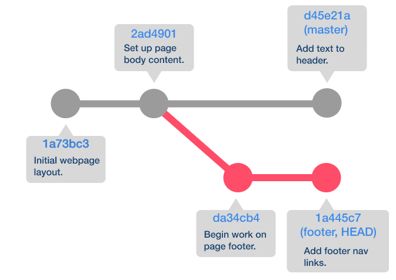
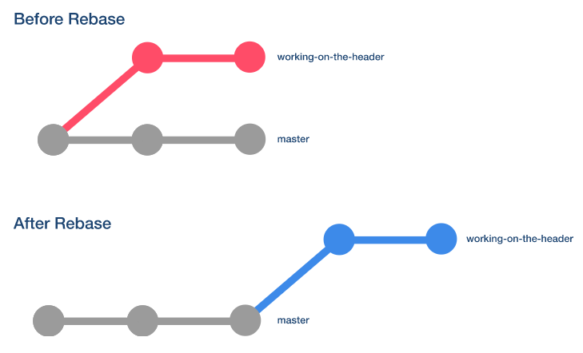

W4D1
====

-   Chrome Repl
-   NodeJS vs. Browser
-   File Input/Output in NodeJS
-   Git Version Control
-   Git Branches
-   Pull Requests (Git)
-   Merge Conflicts (Git)

Chrome Browser Repl
-------------------

-   Chrome has great JavaScript developer tools that we will be using throughout the bootcamp

How to use the Repl: 1. Right click on any Chrome browser and click inspect 2. Click the `Console` tab on the interface that opens 3. Right any JS code in the console

NodeJS vs. Browser
------------------

NodeJS has…

Browser has…

“global” object named `global`

“global” object named `window`

NodeJS-specific objects like `process`

browser-specific objects like `location` and `document`

a `require` function to import another `.js` file

**no** `require` function

access to `node_modules` like `readline`

-   **no** access to `node_modules`

File Input/Output in NodeJS
---------------------------

[File I/O Demo](./file_io.js)

-   `fs` (file-system) built-in node module will allow us to read and write to files
-   `fs` has synchronous and asynchronous versions of the same function so make sure you pick the right one!
-   `fs.writeFile` and `fs.readFile` are asynchronous

[`fs` Documentation](https://nodejs.org/api/fs.html)

What is a Git Repo?
-------------------

### Terminology

-   `commit` - a saved version of your current folder
-   Working Directory - current uncommitted changes to your files
-   Staging Area - still uncommitted changes to your files but prepped for commit
-   Local Repository - the local git repository that holds all your committed versions 
-   `branch` - a linear series of commit versions 
-   `HEAD` - last committed change to the branch you are currently on
-   `master` branch - first created branch when initializing a git repository
-   `merge` - can merge commits on one branch into another branch

### Commands

`git init` - initializes a git repository in a folder - creates a hidden folder, `.git`, can be seen by using command, `ls -a` - **DO NOT** initialize a git repository on your Desktop or your root! - **DO NOT** have a nested git repository!! (a folder with a git repo in a folder with a git repo) - If you do any of the above, you can delete the hidden `.git` folder created with: `rm -rf .git` &gt;&gt; **PLEASE MAKE SURE TO WRITE THIS OUT EXACTLY BEFORE PRESSING ENTER!!!! IF YOU DON’T DO IT EXACTLY, YOU MAY DELETE OTHER THINGS OR THE ENTIRE CONTENTS OF THE FOLDER!!!! THEY CANNOT BE RECOVERED**

`git status` - checks if there is a git repository and the status of your git repository

`git add {FOLDER/FILE PATH}` - adds folder or file specified to your staging area from your working directory

`git commit -m 'Write your commit message here...'` - adds all items in your staging area to your local repository bundled as a new version or commit

`git log` - see your past commit history (past versions)

`git log --oneline` - shortened version of the above command

`git diff` - used to compare two versions, or points of time, in a git repository - without arguments, will display the difference between the working directory and the last committed version

`git diff --staged` - compare changes between staging area and last commited version

`git diff {INSERT YOUR COMMIT HERE TO COMPARE}` - compare changes between last commited version and the argument to `git diff`

`git branch` - will show all branches and what branches you are currently on

`git checkout -b {insert-name-of-branch-here}` - creates a new branch with the given name and checks it out

`git checkout {branch-name}` - checks out the branch given

`git reset`
-----------

-   used to rollback commits or group local commits into one large commit
-   Careful when using this! Make sure you know what will happen when you reset commits!

### Soft Reset

`git reset --soft {INSERT A COMMIT TO ROLLBACK TO HERE}` - will rollback changes to the commit specified **AND** will add the changes in the commits rolled back to the **STAGING AREA**

### Mixed Reset

`git reset --mixed {INSERT A COMMIT TO ROLLBACK TO HERE}` - will rollback changes to the commit specified **AND** will add the changes in the commits rolled back to the **WORKING DIRECTORY** - is the default reset (`git reset INSERT A COMMIT TO ROLLBACK TO HERE}` will do a mixed reset)

### Hard Reset

`git reset --hard {INSERT A COMMIT TO ROLLBACK TO HERE}` - will rollback changes to the commit specified BUT will **REMOVE** all the changes in the commits rolled back - NO WAY TO GET ANY OF THE CHANGES BACK IN THE COMMITS REMOVED

Pull Requests (PR)
------------------

-   In a proper working dev environment, Pull Requests are made to compare branches with other branches before merging
-   You can add other developers to review your changes before merging onto another branch

`git remote add {name-of-remote} {remote-url}` - adds a remote repository with the given tag name for the url

`git rebase`
------------

-   Careful when using this! Make sure you know what will happen when you rebase commits!

`git rebase {BRANCH NAME or COMMIT HASH}` - takes the HEAD of the branch name or the commit and uses it as the start point of the current branch

### If there is a rebase conflict:

`git rebase --abort` - only if there is a rebase conflict, this will abort the rebase

-   add the changes to the staging once you resolve the rebase conflicts in VSCode

`git rebase --continue` - run this after you add all the changes to staging to continue with the rebase (make sure to run `git status` to see if you still have conflicts after you continue)

-   make sure to see that the rebase was successful before continuing to work

`git merge`
-----------

`git merge {other-branch}` - will take the other branch’s commits and add it into teh current branch - If there is no merge conflict when running merging, then the new commits from the branch you are merging will be added to the master branch

-   After you resolve a merge conflict, it will create a new commit in your git history

### If there is a merge conflict:

`git merge --abort` - only if there is a merge conflict, this will abort the merge

-   add the changes to the staging once you resolve the merge conflicts in VSCode

`git merge --continue` - run this after you add all the changes to staging to continue with the merge (make sure to run `git status` to see if you still have conflicts after you continue)

-   make sure to see that the merge was successful before continuing to work

`git checkout`
--------------

`git checkout {BRANCH NAME or COMMIT HASH}` - used to force the HEAD to be at the checked out branch or commit on a detached branch (Not recommended. Just checkout a new branch and reset the commits on the branch there.)

`git checkout -- {FILE NAME}` - used to reset the file specified to be the same as the HEAD’s version

Other Useful Commands
---------------------

`git config --global user.name {INSERT NAME HERE}` - sets your global git user’s name and displays that for every git commit you make

`git config --global user.email {INSERT EMAIL HERE}` - sets your global git user’s email and displays that for every git commit you make

`git push -u {REMOTE REPO TAG NAME} {BRANCH NAME}` - sets the upstream for the branch to the remote repo and branch so your local git repo will track changes between itself and the remote repo (can see those changes with `git status`)

If you want VSCode to be the editor that opens when changing commit messages, do `EDITOR="code --wait"` in your terminal.

NodeJS Learning Objectives
--------------------------

1.  Define NodeJS as distinct from browser based JavaScript runtimes.
2.  Write a program that reads in a dictionary file using node’s FS API and reads a line of text from the terminal input. The program should ‘spell check’ by putting asterisks around every word that is NOT found in the dictionary.

Git Learning Objectives
-----------------------

1.  Use Git to initialize a repo
2.  Explain the difference between Git and GitHub
3.  Given ‘adding to staging’, ‘committing’, and ‘pushing to remote’, match attributes that apply to each.
4.  Use Git to clone an existing repo from GitHub
5.  Use Git to push a local commit to a remote branch
6.  Use git to make a branch, push it to github, and make a pull request on GitHub to merge it to master
7.  Given a git merge conflict, resolve it
8.  Match the three types of git reset with appropriate descriptions of the operation.
9.  Use Git reset to rollback local-only commits.
10. Identify what the git rebase command does
11. Use git diff to compare a local ‘staging’ branch and ‘master’ branch.
12. Use git checkout to check out a specific commit by commit id
