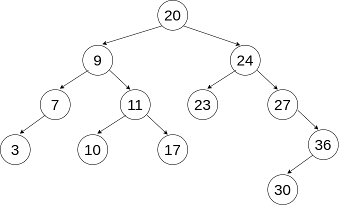

Binary Trees, Graphs, and Network Knowledge (Week 8) - Learning Objectives
==========================================================================

Assessment Structure
--------------------

-   1 hour, 40 minutes
-   Mixture of multiple choice (15-20), free response (1-3) and VSCode (1-3) problems, each with multiple specs.
    -   Free response just requires enough detail to answer the question, 1-3 sentences. As long as you are able to explain the concept and answer all aspects that it asks, you are good.
    -   Coding problems will have specs to run (`npm test`) and check your work against
-   Standard assessment procedures
    -   You will be in an individual breakout room
    -   Use a single monitor and share your screen
    -   Only have open those resources needed to complete the assessment:
        -   Zoom
        -   VSCode
        -   Browser with AAO and Progress Tracker (to ask questions)
        -   Approved Resources for this assessment:
        -   MDN: https://developer.mozilla.org/en-US/docs/Web/JavaScript

Binary Trees (W8D2) - Learning Objectives
-----------------------------------------

### Binary Trees

1.  Explain and implement a Binary Tree.
2.  Identify the three types of tree traversals: pre-order, in-order, and post-order.
3.  Explain and implement a Binary Search Tree.

Problems to consider: 1. What are the requisite attributes of a Tree Node? Implement a Tree Node here:

    class TreeNode = {
      constructor(val) {
        // Tree Node Attributes Here
      }
    }

1.  What logic is necessary to insert a node into a binary search tree? implement it here:

    class BST {
      constructor() {
          this.root = null;
      }

      insert(val, currentNode=this.root) {
        // your code here
      }
    }

1.  Given a tree, be able to determine the order of each traversal type: 

-   Breadth First: ??
-   Pre-order: ??
-   In-order: ??
-   Post-order: ??

Graphs (W8D3) - Learning Objectives
-----------------------------------

### Graphs

1.  Explain and implement a Graph.
2.  Traverse a graph.

Problems to consider:

1.  Remember there are different ways to implement a Graph. We learned about the Adjacency Matrix, Adjacency List, and Node Implementations. What are the differences between these?
2.  What are the requisite attributes of a Graph Node? Implement a Graph Node here:

    class GraphNode {
      constructor(val){
        // your code here
      }
    }

1.  Given a Graph implemented using an ADJACENCY LIST, traverse the graph using BFS and DFS

    const adjacencyList = {
      'derek':['selam', 'dean'],
      'joe':['selam'],
      'selam': ['derek', 'joe', 'dean', 'jesse'],
      'dean': ['derek', 'jesse'],
      'sam': ['jen'],
      'jesse': ['selam', 'evan'],
      'jen':['sam'],
      'javier':['jen'],
      'chris':[],
      'evan': ['jesse'],
    };

write a function that traverses this list from one name to another name (pick 2) and returns a list of the names it passes along the way using BFS and DFS:

    function breadthFirstSearch(startingName, targetName) {
      // YOUR CODE HERE
    }

    function depthFirstSearch(startingName, targetName) {
      // YOUR CODE HERE
    }

1.  Given a NODE implementation of a Graph, traverse the graph using BFS and DFS

    // Practice for this implementation can be found on the project from WEDNESDAY
    // graphs-intro-project

Network Knowledge (W8D4) - Learning Objectives
----------------------------------------------

### Network Models

1.  Describe the structure and function of network models from the perspective of a developer.

### IP Suite

1.  Identify the correct fields of an IPv6 header.
2.  Distinguish an IPv4 packet from an IPv6.
3.  Describe the following subjects and how they relate to one another: IP Addresses, Domain Names, and DNS.
4.  Identify use cases for the TCP and UDP protocols.
5.  Describe the following subjects and how they relate to one another: MAC Address, IP Address, and a port.
6.  (Optional) Identify the fields of a TCP segment.

-   This is optional additional information! I’ve still included it here since it is listed on the AAO platform, but know that this material is more in depth than you need to know.

1.  (Optional) Describe how a TCP connection is negotiated.

-   This is optional additional information! I’ve still included it here since it is listed on the AAO platform, but know that this material is more in depth than you need to know.

-   Starting a Connection

1.  Explaining the difference between network devices like a router and a switch.

### Network Tools

-   These are tools to be able to see some of the above topics presented on your own machine. Their use, as in commands that you would run or how to read the output, are not assessable material, they are simply included to provide an opportunity to see the some of the above concepts in action.

1.  Use `traceroute` to show routes between your computer and other computers.
2.  Use Wireshark to show/inspect network traffic.
