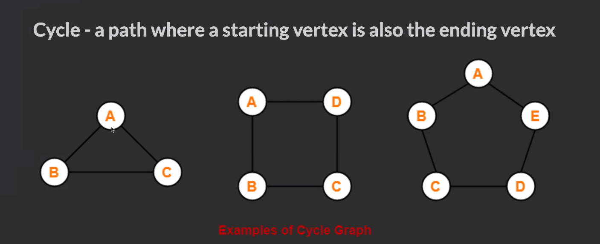
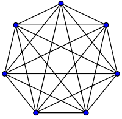
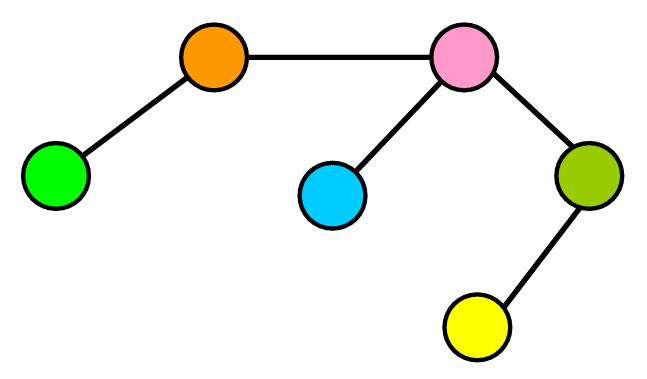
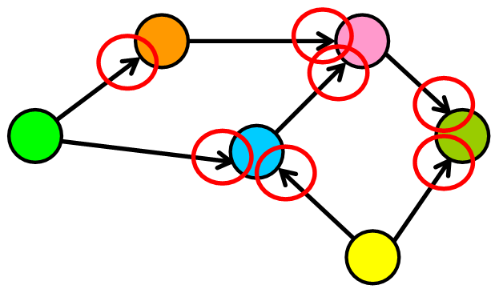
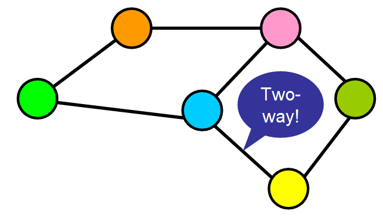
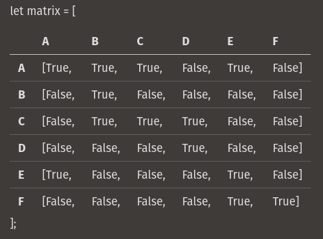

Graphs
======

Contents
--------

Concepts Overview

Types of Graphs

Ways to Reference Graph Nodes

-   Node Class
-   Adjacency Matrix
-   Adjacency List

Code Examples

Basic Graph Class

Node Class Example

Traversal Examples

-   With Graph Node Class
-   With Adjacency List

Basics
------

-   A graph is any collection of nodes and
    -   Much more relaxed in structure than a tree.
-   It doesn’t need to have a root node (not every node needs to be accessible from a single node)
-   It can have cycles (a group of nodes whose paths begin and end at the same node)
    -   Cycles are not always “isolated”, they can be one part of a larger graph. You can detect them by starting your search on a specific node and finding a path that takes you back to that same node.
-   Any number of edges may leave a given node
-   A Path is a sequence of nodes on a graph

Graph Types
-----------

### Complete Graph

-   All nodes connect to all other nodes

### Dense Graph

-   A graph with lots of edges.

> “Dense graphs have many edges. But, wait! ⚠️ I know what you must be thinking, how can you determine what qualifies as “many edges”? This is a little bit too subjective, right? ? I agree with you, so let’s quantify it a little bit: Let’s find the maximum number of edges in a directed graph. If there are |V| nodes in a directed graph (in the example below, six nodes), that means that each node can have up to |v| connections (in the example below, six connections). Why? Because each node could potentially connect with all other nodes and with itself (see “loop” below). Therefore, the maximum number of edges that the graph can have is |V|\\\*|V| , which is the total number of nodes multiplied by the maximum number of connections that each node can have."

### Sparse Graph

-   Sparse Graph: A graph with few edges
-   When the number of edges in the graph is significantly fewer than the maximum number of edges, the graph is sparse.

### Weighted Graph

-   Weighted Graph: Edges have a cost or a weight to traversal

### Directed Graph

-   Directed Graph: Edges only go one direction

### Undirected Graph

-   Undirected Graph: Edges don’t have a direction. All graphs are assumed to be undirected unless otherwise stated

Ways to Reference Graph Nodes
-----------------------------

### With a Node Class

Uses a class to construct a node and define the neighbors as properties of each node.

                        class GraphNode {
                        constructor(val) {
                        this.val = val;
                        this.neighbors = [];
                        }
                        }
                        let a = new GraphNode("a");
                        let b = new GraphNode("b");
                        let c = new GraphNode("c");
                        let d = new GraphNode("d");
                        let e = new GraphNode("e");
                        let f = new GraphNode("f");
                        a.neighbors = [e, c, b];
                        c.neighbors = [b, d];
                        e.neighbors = [a];
                        f.neighbors = [e];

### With an Adjacency Matrix

-   The row index will corespond to the source of an edge and the column index will correspond to the edges destination.
-   When the edges have a direction, \`matrix\[i\]\[j\]\` may not be the same as \`matrix\[j\]\[i\]\`
-   It is common to say that a node is adjacent to itself so \`matrix\[x\]\[x\]\` is true for any node
-   Will be O(n^2) space complexity

### With an Adjacency List

Seeks to solve the shortcomings of the matrix implementation. It uses an object where keys represent node labels and values associated with that key are the adjacent node keys held in an array.

                            let graph = {
                                a: ["b", "c", "e"],
                                b: [],
                                c: ["b", "d"],
                                d: [],
                                e: ["a"],
                                f: ["e"],
                              };

Code Examples
-------------

### Basic Graph Class

                                class Graph {
                                    constructor() {
                                      this.adjList = {};
                                    }

                                    addVertex(vertex) {
                                      if (!this.adjList[vertex]) this.adjList[vertex] = [];
                                    }

                                    addEdges(srcValue, destValue) {
                                      this.addVertex(srcValue);
                                      this.addVertex(destValue);
                                      this.adjList[srcValue].push(destValue);
                                      this.adjList[destValue].push(srcValue);
                                    }

                                    buildGraph(edges) {
                                      edges.forEach((ele) => {
                                        this.addEdges(ele[0], ele[1]);
                                      });
                                      return this.adjList;
                                    }

                                    breadthFirstTraversal(startingVertex) {
                                      const queue = [startingVertex];
                                      const visited = new Set();
                                      const result = new Array();

                                      while (queue.length) {
                                        const value = queue.shift();
                                        if (visited.has(value)) continue;
                                        result.push(value);
                                        visited.add(value);
                                        queue.push(...this.adjList[value]);
                                      }
                                      return result;
                                    }

                                    depthFirstTraversalIterative(startingVertex) {
                                      const stack = [startingVertex];
                                      const visited = new Set();
                                      const result = new Array();

                                      while (stack.length) {
                                        const value = stack.pop();
                                        if (visited.has(value)) continue;
                                        result.push(value);
                                        visited.add(value);
                                        stack.push(...this.adjList[value]);
                                      }
                                      return result;
                                    }

                                    depthFirstTraversalRecursive(
                                      startingVertex,
                                      visited = new Set(),
                                      vertices = []
                                    ) {
                                      if (visited.has(startingVertex)) return [];

                                      vertices.push(startingVertex);
                                      visited.add(startingVertex);

                                      this.adjList[startingVertex].forEach((vertex) => {
                                        this.depthFirstTraversalRecursive(vertex, visited, vertices);
                                      });
                                      return [...vertices];
                                    }

### Node Class Examples

                                class GraphNode {
                                    constructor(val) {
                                      this.val = val;
                                      this.neighbors = [];
                                    }
                                  }

                                  function breadthFirstSearch(startingNode, targetVal) {
                                    const queue = [startingNode];
                                    const visited = new Set();

                                    while (queue.length) {
                                      const node = queue.shift();
                                      if (visited.has(node.val)) continue;
                                      visited.add(node.val);
                                      if (node.val === targetVal) return node;
                                      node.neighbors.forEach((ele) => queue.push(ele));
                                    }
                                    return null;
                                  }

                                  function numRegions(graph) {
                                    let maxLength = 0;
                                    for (node in graph) {
                                      if (graph[node].length > maxLength) maxLength = graph[node].length;
                                    }
                                    if (maxLength === 0) {
                                      return (length = Object.keys(graph).length);
                                    } else {
                                      return maxLength;
                                    }
                                  }

                                  function maxValue(node, visited = new Set()) {
                                    let queue = [node];
                                    let maxValue = 0;
                                    while (queue.length) {
                                      let currentNode = queue.shift();
                                      if (visited.has(currentNode.val)) continue;
                                      visited.add(currentNode.val);
                                      if (currentNode.val > maxValue) maxValue = currentNode.val;
                                      currentNode.neighbors.forEach((ele) => queue.push(ele));
                                    }
                                    return maxValue;
                                  }

### Traversal Examples

With a Graph Node Class

                                function depthFirstRecur(node, visited = new Set()) {
                                    if (visited.has(node.val)) return;

                                    console.log(node.val);
                                    visited.add(node.val);

                                    node.neighbors.forEach((neighbor) => {
                                      depthFirstRecur(neighbor, visited);
                                    });
                                  }

                                  function depthFirstIter(node) {
                                    let visited = new Set();
                                    let stack = [node];

                                    while (stack.length) {
                                      let node = stack.pop();

                                      if (visited.has(node.val)) continue;

                                      console.log(node.val);
                                      visited.add(node.val);

                                      stack.push(...node.neighbors);
                                    }
                                  }
                            
                        

With an Adjacency List

                                function depthFirst(graph) {
                                    let visited = new Set();

                                    for (let node in graph) {
                                      _depthFirstRecur(node, graph, visited);
                                    }
                                  }

                                  function _depthFirstRecur(node, graph, visited) {
                                    if (visited.has(node)) return;

                                    console.log(node);
                                    visited.add(node);

                                    graph[node].forEach((neighbor) => {
                                      _depthFirstRecur(neighbor, graph, visited);
                                    });
                                  }
                            
                        
