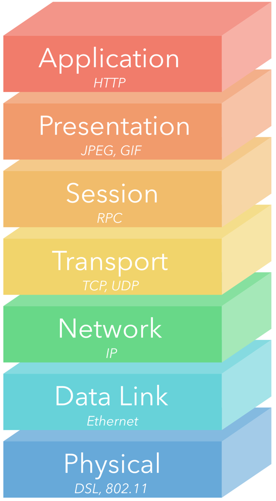
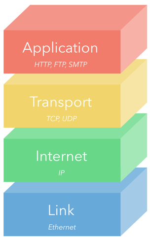
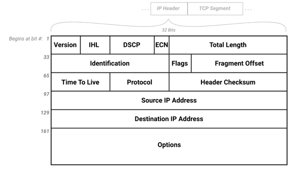
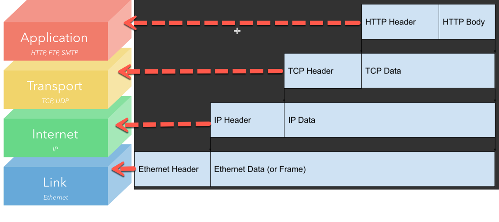
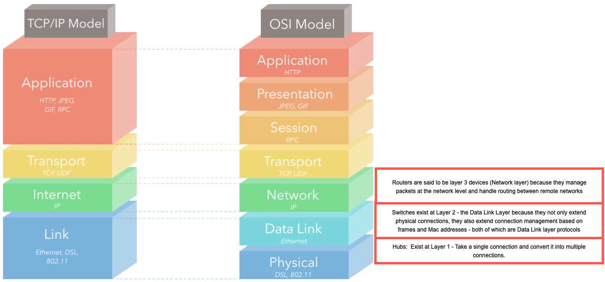
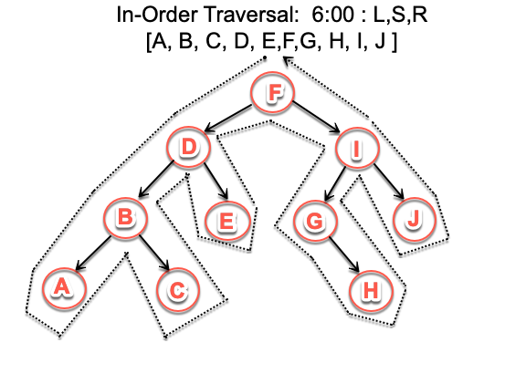

Week 8 Quiz

Start Quiz 8

Reset Quiz

SHOW

Name the layers in an OSI Network Model

SHOW

Name the layers in a TCP/IP Network Model

SHOW

In the OSI Network Model, briefly describe what protocol each layer uses.

<table><thead><tr class="header"><th>Layer</th><th>Protocol and description</th></tr></thead><tbody><tr class="odd"><td>Application</td><td>HTTP is a common Application Layer protocol. Data transmitted on this layer will interact directly with applications.</td></tr><tr class="even"><td>Presentation</td><td>JPEG, GIF are examples of protocols at this layer. This is where the data gets translated into a presentable format.</td></tr><tr class="odd"><td>Session</td><td>RPC (Remote Procedure Call): Includes protocols responsible for authentication and data continuity. May authroize a client with a server or re-establish a dropped connection.</td></tr><tr class="even"><td>Transport</td><td>TCP/UDP: These processes focus on data integrity and connectivity</td></tr><tr class="odd"><td>Network</td><td>IP: Manages connections between remote networks, transferring packets across intermediary devices.</td></tr><tr class="even"><td>Data Link</td><td>Ethernet : Deals with connections directly from one machine’s network interface to another. Frames targeting different MAC addresses are transferred here. This layer is primarily used by machines in local networks.</td></tr><tr class="odd"><td>Physical</td><td>Wi-Fi (802.11) and DSL : Translate from raw electrical signals to bits and bytes of data.</td></tr></tbody></table>

SHOW

In the TCP/IP model, briefly describe the 4 layers

<table><thead><tr class="header"><th>Layer</th><th>Protocols and application</th></tr></thead><tbody><tr class="odd"><td>Application</td><td>HTTP, HTTPS, FTP, SMTP, etc. Includes protocols related to user user-facing data.</td></tr><tr class="even"><td>Transport</td><td>TCP and UDP. Focuses on connectivity between clients and servers.</td></tr><tr class="odd"><td>Internet</td><td>IP. Where data is processed in packets, and where routing is handled with IP addresses. This layer focuses primarly on connecting separate networks together using the Internet Protocol (IP).</td></tr><tr class="even"><td>Link</td><td>Ethernet. This layer is the lower-level communication, concerned with getting data from one local network resource to another.</td></tr></tbody></table>

SHOW

What are some use cases for TCP protocol?

Anytime data integrity is important:

1.  Websites
2.  File downloads
3.  streaming videos/audio : where watching videos or listening to podcasts you may need to see every frame.

SHOW

What are some use cases for the UDP protocol?

When performance is more important than quality:

1.  VOIP (Voice over IP)
2.  Real-time video : Here you want to keep pace with the video as it is real-time so missing a packet isn’t as important as keeping pace with the video.
3.  Network services

SHOW

What is a TLD?

Top level domain: The last part of the domain. e.g.: .com, .net, .org

SHOW

What is a second-level domain

SHOW

What does TCP stand for?

Transmission Control Protocol : Used when you want reliable connections such as web browsing, downloading files, fetching email, streaming music or videos.

SHOW

What does UDP stand for:

User Datagram Protocol: Used when you don’t mind a more unreliable connection, but real time interactivity is more important. Voice Over IP, Video Chat are examples of where you might use UDP

SHOW

What is a MAC Address?

A hardware address assigned to every physical networking device on a network. They look like a series of Hexidecimal values like ea:de:36:d9:5a:b8; They are used to communicate on the local network ONLY.

SHOW

Describe an IP address

An address assigned to a networking device. Usually assigned by an ISP or a router on a local network using DHCP. They are used to route connections across multiple networks. Example: IPV4: 192.168.1.1

SHOW

Describe a Port

Represents a TCP/UDP connection on an actual computer. Valid ports are in the range from 0 - 65535. Used by the operating system of a computer to route TCP connections to the right program running on a computer. These programs can be said to be “listening” on a port. No two programs are allowed to listen on the same port at once.

SHOW

What are the default ports for web servers?

HTTP port 80, and HTTPS port 443.

SHOW

What is a Network Hub?

A device which hooks multiple computers together over ethernet and blindly repeats ethernet packets to all the other devices on a local area network.

SHOW

What is a network switch?

A device which intelligently hooks multiple computers together over ethernet and sends ethernet packets to the correct devices on a local area network based on MAC addresses.

SHOW

What is a router?

A device which is responsible for routing IP packets BETWEEN Different networks.

SHOW

What is an IP Address

The internet protocol address assigned to a particular networking device

SHOW

What is a domain name?

A human readable name assigned to an IP address. Examples: google.com or appacademy.io.

SHOW

What is DNS?

Domain Name System: A protocol (on UDP port 53) that allows our computer to talk to a DNS Server and resolve a Domain Name into an IP address. Example: google.com might resolve to 172.217.6.142.

SHOW

What is a DNS A Record?

This record directly maps a domain name to an IPv4 Address

SHOW

What is a DNS AAAA record?

This directly maps a domain name to an IPv6 Address

SHOW

What is a CNAME record?

This maps a domain name to another domain name. An alias, you might say.

SHOW

What is an MX record?

This defines the mail server for a domain.

SHOW

What is an NS record?

This defines the DNS Servers for a zone (domain)

SHOW

What is an SOA?

Start of Authority: Defines which DNS Server is the authority for a zone (domain)

SHOW

In the IP packet header, where do you discover whether this is an IPv4 or IPv6 packet?

In the version. This is a binary number. IPv4 = 0100; IPv6 = 0110. The version number is the 1st-&gt;4th bit in the packet

SHOW

How many octets make up an IPv4 address?

4 octets: 192.168.1.1 for example

SHOW

How is an IPv6 number made up?

-   IPv6 addresses are made up of a 128bit number
-   IPv6 addresses are typically represented as hexidecimal, with every 4 digits separated by a ‘:’
-   Example: 2001:0db8:85a3:0000:0000:8a2e:0370:7334

SHOW

Describe the rules for reformatting an IPv6 address

-   Example: 2001:0db8:85a3:0000:0000:8a2e:0370:7334
-   You can replace 4 zeroes in an IPv6 address with only 1 zero
-   Leading zeroes can be removed (0370 -&gt; 370)
-   An entire string of zeroes can be removed, but you can only do this once
-   The above IPv6 string can be reformatted with these rules as follows: 2001:db8:85a3::0:8a2e:370:7334

SHOW

Describe an IPv6 header

The IPv6 header

SHOW

Which version is this IP header?

IPv4 : Identified by the first 4 bits on the header, 0100 = 4. Also, this header has many additional fields included in it. IHL, DSCP, ECN, Total Length, Identification, Flags, Fragment Offset, Time To Live, Protocol, Header Checksum and Options. Notice the 3 fields that are the same between IPv4 and IPv6 headers: Version, Source IP Address and Destination IP Address

SHOW

Identify which IP version this header is:

IPv6: Notice many fewer fields (8 vs 14), but has Version, Source IP Address and Destination IP Address in common

SHOW

Which TCP/IP Layer does the IP Header reside?

The Internet Layer (IP)

SHOW

In the OSI Model, which layer do Hubs, Switches and Routers exist at?

SHOW

Is a linked list a graph?

Yes!

SHOW

What is a Tree?

A tree is a graph that does not contain any cycles. Note the image below. Tree 4 is a graph in mathematics, but in computer science it is not.

SHOW

Define a binary tree

A binary tree is a tree where nodes have at most 2 children. Graphs 1, 2 and 3 are all binary trees shown below.

SHOW

Define the three binary tree depth-first searches (traversing the tree)

1.  Pre-order traversal : 9:00 : S, L, R
2.  In-order traversal : 6:00 : L, S, R
3.  Post-order traversal : 3:00 : L, R, S

SHOW

Determine the nodes to be searched in pre-order traversal, in the following graph:

SHOW

Determine the nodes to be searched in in-order traversal, in the following graph:

SHOW

Determine the nodes to be searched in post-order traversal in the following graph:

SHOW

Write a recursive function to print a binary search tree inOrder

\`\`

        function inOrderPrint(root) {
            if (!root) return;

            inOrderPrint(root.left);
            console.log(root.val);
            inOrderPrint(root.right);
        }

SHOW

Write a recursive function to print a binary search tree in PostOrder

\`\`

        function postOrderPrint(root) {
            if (!root) return;

            postOrderPrint(root.left);
            postOrderPrint(root.right);
            console.log(root.val)
        }

SHOW

Write a recursive function to print a binary search tree in PreOrder

\`\`

        function inPreOrder(root) {
            if (!root) return;

            console.log(root.val);
            inPreOrder(root.left);
            inPreOrder(root.right);
        }

SHOW

Write a recursive function to perform a breadth-first search.

\`\`

        function printBreadthFirst(root) {
            let queue = [];
            queue.push(root);
            while (queue.length) {
                let currNode = queue.shift();
                if (currNode.left) queue.push(currNode.left);
                if (currNode.right) queue.push(currNode.right);
                console.log(currNode.val);
            }
        }

SHOW

Write a recursive function that returns an array in postOrder.

\`\`

        function postOrderArray(root) {
            if (!root) return [];

            return [
                ...postOrderArray(root.left),
                ...postOrderArray(root.right),
                root.val
            ]
        }

SHOW

Write a function that returns an array in pre-order order.

\`\`

        function preOrderArray(root) {
            if (!root) return [];

            return [
                root.val,
                ...preOrderArray[root.left],
                ...preOrderArray[root.right]
            ]
        }

SHOW

Write a function that returns an array inOrder order.

\`\`

        function inOrderArray(root){
            if (!root) return [];
            return [
                ...inOrderArray(root.left),
                root.val,
                ...inOrderArray(root.right)
            ]
        }

SHOW

Write a function that adds a node to a binary search tree

\`\`

        function add(root, val) {
            if (!root) //root is null
            {
                let newNode = new Node(val);
                root = newNode;
            }

            if (val < root.val) {
                if (root.left === null) {
                    let newNode = new Node(val);
                    root.left = newNode;
                } else {
                    add(root.left, val);
                }
            else if (val > root.val) {
                if (root.right === null) {
                    let newNode = new Node(val);
                    root.right = newNode;
                } else {
                    add(root.right, val);
                }
            }

SHOW

Write a function to search a binary search tree recursively for a value. If the value is found, return true. Otherwise return false.

\`\`

        function searchRecurse(root, val) {
            if (!root) return false;

            if(root.val < val) {
                return searchRecurse(root.right, val);
            } else if (root.val > val) {
                return searchRecurse(root.left, val);
            } else // (root.val === val) {
                return true;
            }
        }

SHOW

Write an iterative search for a binary tree, returning true or false if the value is found.

\`\`

        function searchIter(root, val) {
            let currNode = root;
            while (currNode) {
                if (currNode.val < val) {
                    currNode = currNode.right;
                } else if (currNode.val > val) {
                    currNode = currNode.left;
                } else if (currNode.val === val) {
                    return true;
                }
            }
            return false;
        }

SHOW

What are the two properties that make a Binary Tree a Binary Search Tree

1.  The left subtree values must be less than the root.
2.  The right subtree values must be greater than the root.

SHOW

Define a graph

A graph is a collection of nodes and any edges between those nodes.

SHOW

Are linked lists a subclass of a graph?

Yes!

SHOW

Are trees a subclass of graphs?

Yes!

SHOW

Are binary search trees a subclass of graphs?

Yes!

SHOW

Name two ways we can create a graph

1.  Using a class: GraphNode with two properties: val, and neighbors = \[\]
2.  Using an adjacency list: graph = { ‘a’ : \[‘b’\], ‘b’ : \[‘a’\] }

SHOW

Write a breadthFirstSearch for a graph, iteratively.

\`\`

        let graph = {
            'q': ['r'],
            'r': ['q'],
            's': ['t'],
            't': ['s', 'u', 'v'],
            'u': ['t', 'v'],
            'v': ['u', 't'],
            'w': []
        };

        function breadthFirstSearch(graph, startingNode, targetVal) {
            let queue = [ startingNode ];
            let visited = new Set();
            while(queue.length) {
                let node = queue.shift();
                if (visited.has(node)) continue;
                visited.add(node);
                if (node === targetVal) return true;
                queue.push(...graph[node]);
            }
            return false;
        }

        breadthFirstSearch(graph, graph['t'], 'q'); //returns true;
        breadthFirstSearch(graph, graph['q'], 'c'); //returns false;

SHOW

Write a depth-first Search on the adjacency list graph.

Note with the following: If your graph has disjointed subgraphs - in that there is no way to move from one subgraph to another, your starting node is ONLY the subgraph you want to search through. Also note, this algorithm only works on graphs with NO cycles. We won’t be tested on searching through a cycle for depth-first, so set that topic aside. Also note, mathematicians consider cycles as a graph. Computer scientists do not.

\`\`

        const depthFirst = (graph, node, targetVal, visited = new Set()) => {
            if (node === targetVal) return true;
            visited.add(node);
            for (let neighbor of graph[node]) {
              if (visited.has(neighbor)) continue;
              if (depthFirst(graph, neighbor, targetVal, visited)) {
                return true;
              }
            }
            return false;
          };

SHOW

Name the steps for whiteboarding.

1.  Clarify the problem & test I/O and edge cases
2.  Formulate your approach(es)
3.  Pseudocode your best approach
4.  Code it
5.  Walk through an example input
6.  Determine the Big O time and space complexity
