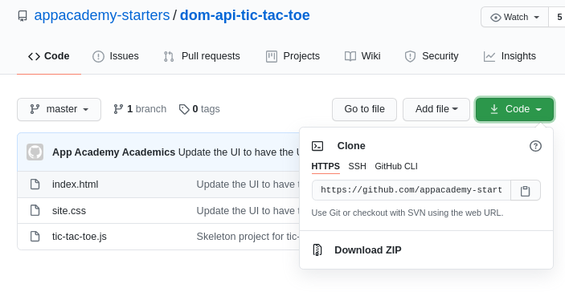
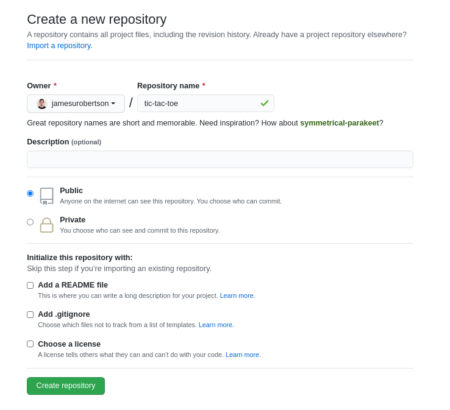

Steps to clone and change origin to push to your own repo
=========================================================

1. The first step is to clone the repo!
---------------------------------------

-   Navigate to the repo you want to clone and hit the big green code button. Copy the link given.

-   Navigate in your terminal to the directory where you want this repo to live. I chose ~/Documents/appAcademy
-   `git clone HTTPS://LINKTOURL/THATYOUCOPIED`

2. Sweet, you have the cloned repo in your preferred directory. Now lets make your own repo. On github, create a new repository.
--------------------------------------------------------------------------------------------------------------------------------

-   Default settings are fine. Hit the big green button `Create Repository`

3. Next, copy the .git link that is on the next page. Do not do any other steps on this page - That is for when you do not clone a repo.
----------------------------------------------------------------------------------------------------------------------------------------

4. Whenver you clone a repo it already has a .git directory with certain configurations set up. To be able to push this repo to your newly created GitHub repo we have to change the remote origin.
---------------------------------------------------------------------------------------------------------------------------------------------------------------------------------------------------

-   To do that, just run this command: (Make sure you are inside the repo you cloned)
    -   `git remote set-url origin https://LINK/TO/YOUR/GIT/THAT/YOU/COPIED/FROM/PREVIOUS/STEP.git`

    

5. Thats its! You can now run `git push` and it will push to your newly created repo. Try it out :)
---------------------------------------------------------------------------------------------------
